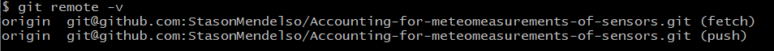

# Accounting for meteomeasurements of sensors

## What is the project about?

Repository is for implementing the last technical task from the [course](https://www.udemy.com/course/spring-alishev/) -
creating a REST API server-application for accounting for meteomeasurements of
sensors and a RestTemplate client-application for sending meteomeasurements of sensors. 
You can find more information about task [here](Project%20Technical%20Task.pdf).

## What is the purpose of this project?

The **purpose** of the project is ***using knowledge*** in practice, learned
about the REST API and Rest Template on the [course](https://www.udemy.com/course/spring-alishev/),
how it should be used to implement the task. As for me, I haven't got
almost any experience of implementing [REST API][2] in such tasks, so I want to try it.

In addition to, it is the first project, where I use the REST API architecture for implementing
such technical task.

## Getting Started

For running the REST API application you need to download the latest version from the main branch, open package [server](server),
configure the application, the database and connection to it. 

For running the REST Template application you need to download the latest version from the main branch, open package [client](client), 
run demo methods. 

Follow the next chapters.

### Prerequisites

For running the project you need the next:

* [PostgreSQL 15](https://www.postgresql.org/) - for running the server with database. Also you can use another DBMS.
  You can find the [script](server/database/dump.sql) of creating database in directory with name "*[database](server/database)*".

### Installation Instruction

#### How to download project on my local machine?

For downloading the project locally you can use two variants:

1. Download the ZIP archive from the repository page.

   The method is easy, the next steps helps you:
    1. Find the button `Code` and press it.
    2. Find the button `Download ZIP` and press it. The downloading must start.
    3. Unzip the archive in soe directory and run the IDEA in this directory.

   Project has been installed. After opening it in your IDEA, the `Maven` downloads
   some additional dependencies.
2. Use the `Git` for downloading the repository locally.

   The method a lit bit difficult, but the project will be downloaded with the help
   of several commands, and not manually, as in the previous method. For this method
   you **need** to [install][4] the `Git Bash` on your computer, make some configuration and have a primary skill of
   using this system of version control.
    1. Enter your [name][5], [email][6] of GitHub account locally on your machine.
    2. Create an empty directory and initialize it as git repository. Use the next
       command - `git init`.
    3. Adds this repository to yours with name `origin` (you can change it, if you want):
        ```
       $ git remote add origin git@github.com:StasonMendelso/Accounting-for-meteomeasurements-of-sensors.git
       ```
       But you need configure your SSH connection to your GitHub profile in Git Bash. See more [here][7].

       For viewing that the repository has been added successfully to your local
       repository, you need execute the next command and get the following result:
       ```
       $ git remote -v
       ```
       

       After this step your local repository has got a 'connection' to the remote
       project from the GitHub repository.
    4. For downloading the project use the following command:
       ```
       $ git pull origin
       ```
       After these steps your project directory must contain the project files from
       GitHub repository. In addition to, you can create a new branch, make some
       changes and create a pull request for suggesting your improvements. Also, all
       changes are observed by the `git` and you can always make a rollback of
       all changes `git reset --hard`.

### What things you need to install the software and how to configure them?

##### Database configuration

For running the database you can use as me PostgreSQL or create your own database on another SQL server
using the [script](server/database/dump.sql) file of creating the database.
<br>
**Note**: if you use another DBMS not such
PostgreSQL you should change JDBC driver for working with it and configurate the connection to your
server in appropriate property file, which you must create later manually. If you change driver, you should
make some changes in [pom.xml file](server/pom.xml)
<br>

##### Server configuration

For running the code you needn't install server and configure it, because the Spring Boot starter
makes it instead of you using the pom.xml.

### Running the REST server-application
You can find an empty [application configuration file](server/src/main/resources/application.properties.origin),
which must be renamed to "*application.properties*" instead of "*application.properties.origin*". This file
contains only keys for configuration the application using the Spring Boot, so you can put your values to the file and run
application with this application configuration. You can find more about configuration of Spring Boot application on
the Internet.
<br>
For running the app on the server you need only run the main method in Java class. Also, you can
package app to the jar(war) file and deploy the file on the server manually.

### Running the Rest Template client-application
For running the client you should open the [client](client) package and find the demo classes with main methods, which
you can run after running the server-application. It may be necessary to adjust the URL of requests for requesting to the 
REST server-application.

## Endpoints of REST API.
##### Endpoints
Some endpoint to the server:

* "**localhost:{port}/{applicationContext}/measurements**" - to get access to the measurements;
* "**localhost:{port}/{applicationContext}/sensors**" - to get access to the sensors;

where  **{port}** - is a port, on which you server is running; **{applicationContext}** - is an application
context name, which you give in your application configuration for this app.
 
##### Examples
You can use as me a [Postman](https://www.postman.com/) to send these requests:


## Built With

* [Maven](https://maven.apache.org/) - Dependency Management

## Author

* **Stanislav Hlova** - *All work* - [StasonMendelso](https://github.com/StasonMendelso)

[1]:https://www.udemy.com/course/spring-alishev/

[2]:https://en.wikipedia.org/wiki/Representational_state_transfer

[4]:https://git-scm.com/downloads

[5]:https://docs.github.com/en/get-started/getting-started-with-git/setting-your-username-in-git

[6]:https://docs.github.com/en/account-and-profile/setting-up-and-managing-your-personal-account-on-github/managing-email-preferences/setting-your-commit-email-address

[7]:https://docs.github.com/en/authentication/connecting-to-github-with-ssh
